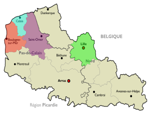

# 2024 CDA P1 BSM

Titre Professionnel  
Concepteur Développeur d'Applications
Hauts-de-France

## Qui sommes nous

<figure>
    

        
    

    

        <figcaption>
            <a href="https://2024-cda-boulogne.github.io/Trombi_TD_GN" align="center">Trombinoscope</a>
        </figcaption>
    

</figure>

## Les technologies utilisées

&nbsp;&nbsp;

&nbsp;&nbsp;

&nbsp;&nbsp;

## Nos réalisations

|                            Briefs                             |                                                          Technologies                                                           |          <a href="https://github.com/JunkBezoul">AlexB</a>           |           <a href="https://github.com/Theo02-12">ThéoC</a>           |            <a href="https://github.com/Ericdsr">EricD</a>            |          <a href="https://github.com/Yokokorico">ThéoD</a>           |          <a href="https://github.com/DASyhef">CédricF</a>           |         <a href="https://github.com/viviengajac">VivienG</a>         |          <a href="https://github.com/Karl-Gavois">KarlG</a>          |         <a href="https://github.com/kevin-ledez">KévinL</a>          |       <a href="https://github.com/Merlinovitch">AlexandreM</a>       |        <a href="https://github.com/Geoffrey184">GeoffreyN</a>        |          <a href="https://github.com/NOTLimai">WilliamT</a>          |          <a href="https://github.com/Simon-vnct">SimonV</a>          | 
| :-----------------------------------------------------------: | :-----------------------------------------------------------------------------------------------------------------------------: | :------------------------------------------------------------------: | :------------------------------------------------------------------: | :------------------------------------------------------------------: | :------------------------------------------------------------------: | :------------------------------------------------------------------: | :------------------------------------------------------------------: | :------------------------------------------------------------------: | :------------------------------------------------------------------: | :------------------------------------------------------------------: | :------------------------------------------------------------------: | :------------------------------------------------------------------: | :------------------------------------------------------------------: |
| [Wiki perso](https://github.com/2024-cda-boulogne/wiki-perso) | &nbsp;&nbsp; | <a href="https://github.com/2024-cda-boulogne/wiki-perso-abu">🔗</a> | <a href="https://github.com/2024-cda-boulogne/wiki-perso-tco">🔗</a> | <a href="https://github.com/2024-cda-boulogne/wiki-perso-eda">🔗</a> | <a href="https://github.com/2024-cda-boulogne/wiki-perso-tdu">🔗</a> |  | <a href="https://github.com/2024-cda-boulogne/wiki-perso-vga">🔗</a> | <a href="https://github.com/2024-cda-boulogne/wiki-perso-kga">🔗</a> | <a href="https://github.com/2024-cda-boulogne/wiki-perso-kle">🔗</a> | <a href="https://github.com/2024-cda-boulogne/wiki-perso-ame">🔗</a> | <a href="https://github.com/2024-cda-boulogne/wiki-perso-gno">🔗</a> | <a href="https://github.com/2024-cda-boulogne/wiki-perso-wtr">🔗</a> |  |
|     [Trombi](https://github.com/2024-cda-boulogne/trombi)     | &nbsp;&nbsp; |   <a href="https://github.com/2024-cda-boulogne/Trombi_AbuAme">🟠</a>   |   <a href="https://github.com/2024-cda-boulogne/trombi-tco-wtr">🟡</a>   |   <a href="https://github.com/2024-cda-boulogne/trombi_vga_edsr">⚫</a>    |   <a href="https://github.com/2024-cda-boulogne/Trombi_TD_GN">⚪</a>    |       |   <a href="https://github.com/2024-cda-boulogne/trombi_vga_edsr">⚫</a>    |   <a href="https://github.com/2024-cda-boulogne/trombi-kle-kga">🟢</a>   |   <a href="https://github.com/2024-cda-boulogne/trombi-kle-kga">🟢</a>   |   <a href="https://github.com/2024-cda-boulogne/Trombi_AbuAme">🟠</a>   |   <a href="https://github.com/2024-cda-boulogne/Trombi_TD_GN">⚪</a>    |   <a href="https://github.com/2024-cda-boulogne/trombi-tco-wtr">🟡</a>   |       |
| [Zythologue](https://github.com/2024-cda-boulogne/zythologue) | &nbsp;&nbsp;&nbsp;&nbsp;| <a href="https://github.com/2024-cda-boulogne/zythologue-abu">🔗</a> | <a href="https://github.com/2024-cda-boulogne/zythologue-tco">🔗</a> | <a href="https://github.com/2024-cda-boulogne/zythologue-eda">🔗</a> | <a href="https://github.com/2024-cda-boulogne/zythologue-tdu">🔗</a> | <a href="https://github.com/2024-cda-boulogne/zythologue-cfr">🔗</a> | <a href="https://github.com/2024-cda-boulogne/zythologue-vga">🔗</a> | <a href="https://github.com/2024-cda-boulogne/zythologue-kga">🔗</a> | <a href="https://github.com/2024-cda-boulogne/zythologue-kle">🔗</a> | <a href="https://github.com/2024-cda-boulogne/zythologue-ame">🔗</a> | <a href="https://github.com/2024-cda-boulogne/zythologue-gno">🔗</a> | <a href="https://github.com/2024-cda-boulogne/zythologue-wtr">🔗</a> | <a href="https://github.com/2024-cda-boulogne/zythologue-svi">🔗</a> |
| [Zythologue API](https://github.com/2024-cda-boulogne/zythologueAPI) |  | <a href="https://github.com/2024-cda-boulogne/zythologueAPI-abu">🔗</a> | <a href="https://github.com/2024-cda-boulogne/zythologueAPI-tco">🔗</a> | <a href="https://github.com/2024-cda-boulogne/zythologueAPI-eda">🔗</a> | <a href="https://github.com/2024-cda-boulogne/zythologueAPI-tdu">🔗</a> | <a href="https://github.com/2024-cda-boulogne/zythologueAPI-cfr">🔗</a> | <a href="https://github.com/2024-cda-boulogne/zythologueAPI-vga">🔗</a> | <a href="https://github.com/2024-cda-boulogne/zythologueAPI-kga">🔗</a> | <a href="https://github.com/2024-cda-boulogne/zythologueAPI-kle">🔗</a> | <a href="https://github.com/2024-cda-boulogne/zythologueAPI-ame">🔗</a> | <a href="https://github.com/2024-cda-boulogne/zythologueAPI-gno">🔗</a> | <a href="https://github.com/2024-cda-boulogne/zythologueAPI-wtr">🔗</a> | <a href="https://github.com/2024-cda-boulogne/zythologueAPI-svi">🔗</a> |
| [Arbre de compétences](https://github.com/2024-cda-boulogne/skilltree) |  | <a href="https://github.com/2024-cda-boulogne/skilltree-kga">🔵</a> | <a href="https://github.com/2024-cda-boulogne/skilltree-tco">⚪</a> | <a href="https://github.com/2024-cda-boulogne/skilltree-kga">🔵</a> | <a href="https://github.com/2024-cda-boulogne/skilltree-tdu">🟢</a> | <a href="https://github.com/2024-cda-boulogne/skilltree-kle">🔴</a> | <a href="https://github.com/2024-cda-boulogne/skilltree-tdu">🟢</a> | <a href="https://github.com/2024-cda-boulogne/skilltree-kga">🔵</a> | <a href="https://github.com/2024-cda-boulogne/skilltree-kle">🔴</a> | <a href="https://github.com/2024-cda-boulogne/skilltree-tdu">🟢</a> | <a href="https://github.com/2024-cda-boulogne/skilltree-tco">⚪</a> | <a href="https://github.com/2024-cda-boulogne/skilltree-tco">⚪</a> | <a href="https://github.com/2024-cda-boulogne/skilltree-kle">🔴</a> |
| [Escape Odyssee](https://github.com/2024-cda-boulogne/escapeodyssee) |  | <a href="https://github.com/2024-cda-boulogne/escapeodyssee-vga">🔴</a> | <a href="https://github.com/2024-cda-boulogne/escapeodyssee-wtr">⚪</a> | <a href="https://github.com/2024-cda-boulogne/escapeodyssee-cfr">🟢</a> | <a href="https://github.com/2024-cda-boulogne/escapeodyssee-ame">🔵</a> | <a href="https://github.com/2024-cda-boulogne/escapeodyssee-cfr">🟢</a> | <a href="https://github.com/2024-cda-boulogne/escapeodyssee-vga">🔴</a> | <a href="https://github.com/2024-cda-boulogne/escapeodyssee-cfr">🟢</a> | <a href="https://github.com/2024-cda-boulogne/escapeodyssee-ame">🔵</a> | <a href="https://github.com/2024-cda-boulogne/escapeodyssee-ame">🔵</a> | <a href="https://github.com/2024-cda-boulogne/escapeodyssee-wtr">⚪</a> | <a href="https://github.com/2024-cda-boulogne/escapeodyssee-wtr">⚪</a> | <a href="https://github.com/2024-cda-boulogne/escapeodyssee-vga">🔴</a> |
| Mon 1er déploiement sur VPS |  | <a href="https://github.com/2024-cda-boulogne/escapeodyssee-vga">🔗</a> | <a href="https://portfolio.clipcutter.fr">🔗</a> | <a href="https://dasilvarocha-eric.fr">🔗</a> | <a href="https://portfolio.tduflos.ovh">🔗</a> | <a href="https://cv-cedric.seagulls-dev.fr">🔗</a> | <a href="https://portfolio.viviengajac.fr">🔗</a> | <a href="https://monportfolio.gavois-k.fr">🔗</a> | <a href="https://naliusweb.fr">🔗</a> | <a href="https://alexandre-merlin.com">🔗</a> | <a href="https://portfolio.geoffreynoel.com">🔗</a> | <a href="https://williamtruant.fr">🔗</a> | <a href="https://portfolio.simon-vincent.fr">🔗</a> |
| [Technologies du Futur](https://github.com/2024-cda-boulogne/turfu) |  | <a href="https://planet-map.vercel.app/">⚪</a> | <a href="https://planet-map.vercel.app/">⚪</a> | <a href="https://github.com/2024-cda-boulogne/solar-system">🔵</a> | <a href="https://github.com/2024-cda-boulogne/solar_system_react">🔴</a> | <a href="https://github.com/2024-cda-boulogne/solar-system">🔵</a> | <a href="https://github.com/2024-cda-boulogne/solar_system_react">🔴</a> | <a href="https://github.com/2024-cda-boulogne/solar-system">🔵</a> | <a href="https://github.com/2024-cda-boulogne/solar-system">🔵</a> | <a href="https://github.com/2024-cda-boulogne/solar_system_react">🔴</a> | <a href="https://planet-map.vercel.app/">⚪</a> | <a href="https://planet-map.vercel.app/">⚪</a> | <a href="https://github.com/2024-cda-boulogne/solar_system_react">🔴</a> |

---
<!-- Projet fil rouge -->

|                        Projet&nbsp;fil&nbsp;rouge                             |          <a href="https://github.com/JunkBezoul">AlexB</a>           |           <a href="https://github.com/Theo02-12">ThéoC</a>           |            <a href="https://github.com/Ericdsr">EricD</a>            |          <a href="https://github.com/Yokokorico">ThéoD</a>           |          <a href="https://github.com/DASyhef">CédricF</a>           |         <a href="https://github.com/viviengajac">VivienG</a>         |          <a href="https://github.com/Karl-Gavois">KarlG</a>          |         <a href="https://github.com/kevin-ledez">KévinL</a>          |       <a href="https://github.com/Merlinovitch">AlexandreM</a>       |        <a href="https://github.com/Geoffrey184">GeoffreyN</a>        |          <a href="https://github.com/NOTLimai">WilliamT</a>          |          <a href="https://github.com/Simon-vnct">SimonV</a>          |
| :-----------------------------------------------------------: | :------------------------------------------------------------------: | :------------------------------------------------------------------: | :------------------------------------------------------------------: | :------------------------------------------------------------------: | :------------------------------------------------------------------: | :------------------------------------------------------------------: | :------------------------------------------------------------------: | :------------------------------------------------------------------: | :------------------------------------------------------------------: | :------------------------------------------------------------------: | :------------------------------------------------------------------: | :------------------------------------------------------------------: |
| [Ma Micro-Saas](https://github.com/2024-cda-boulogne/saasdraft) | <a href="https://github.com/2024-cda-boulogne/saasdraft-abu">🔗</a> | <a href="https://github.com/2024-cda-boulogne/saasdraft-tco">🔗</a> | <a href="https://github.com/2024-cda-boulogne/saasdraft-eda">🔗</a> | <a href="https://github.com/2024-cda-boulogne/saasdraft-tdu">🔗</a> | <a href="https://github.com/2024-cda-boulogne/saasdraft-cfr">🔗</a> | <a href="https://github.com/2024-cda-boulogne/saasdraft-vga">🔗</a> | <a href="https://github.com/2024-cda-boulogne/saasdraft-kga">🔗</a> | <a href="https://github.com/2024-cda-boulogne/saasdraft-kle">🔗</a> | <a href="https://github.com/2024-cda-boulogne/saasdraft-ame">🔗</a> | <a href="https://github.com/2024-cda-boulogne/saasdraft-gno">🔗</a> | <a href="https://github.com/2024-cda-boulogne/saasdraft-wtr">🔗</a> | <a href="https://github.com/2024-cda-boulogne/saasdraft-svi">🔗</a> |
| [La vision de mon projet](https://github.com/2024-cda-boulogne/my-vision) | <a href="https://github.com/2024-cda-boulogne/my-vision-abu">🔗</a> | <a href="https://github.com/2024-cda-boulogne/my-vision-tco">🔗</a> | <a href="https://github.com/2024-cda-boulogne/my-vision-eda">🔗</a> | <a href="https://github.com/2024-cda-boulogne/my-vision-tdu">🔗</a> | <a href="https://github.com/2024-cda-boulogne/my-vision-cfr">🔗</a> | <a href="https://github.com/2024-cda-boulogne/my-vision-vga">🔗</a> | <a href="https://github.com/2024-cda-boulogne/my-vision-kga">🔗</a> | <a href="https://github.com/2024-cda-boulogne/my-vision-kle">🔗</a> | <a href="https://github.com/2024-cda-boulogne/my-vision-ame">🔗</a> | <a href="https://github.com/2024-cda-boulogne/my-vision-gno">🔗</a> | <a href="https://github.com/2024-cda-boulogne/my-vision-wtr">🔗</a> | <a href="https://github.com/2024-cda-boulogne/my-vision-svi">🔗</a> |
| Backlog | <a href="https://github.com/orgs/2024-cda-boulogne/projects/44/views/1">🔗</a> | <a href="https://github.com/orgs/2024-cda-boulogne/projects/31">🔗</a> | <a href="https://github.com/orgs/2024-cda-boulogne/projects/36/views/1">🔗</a> | <a href="https://github.com/users/Yokokorico/projects/3/views/1">🔗</a> | <a href="https://github.com/orgs/2024-cda-boulogne/projects/37/views/1">🔗</a> | <a href="https://github.com/orgs/2024-cda-boulogne/projects/41/views/1">🔗</a> | <a href="https://github.com/orgs/2024-cda-boulogne/projects/34/views/3">🔗</a> | <a href="https://github.com/orgs/2024-cda-boulogne/projects/27">🔗</a> | <a href="https://github.com/users/Merlinovitch/projects/4/views/1">🔗</a> | <a href="https://github.com/orgs/2024-cda-boulogne/projects/39">🔗</a> | <a href="https://github.com/orgs/2024-cda-boulogne/projects/43">🔗</a> | <a href="https://github.com/orgs/2024-cda-boulogne/projects/32/views/1">🔗</a> |
| [Hello from API 🙂](https://github.com/2024-cda-boulogne/app) | <a href="https://github.com/2024-cda-boulogne/app-abu">🔗</a> | <a href="https://github.com/2024-cda-boulogne/app-tco">🔗</a> | <a href="https://github.com/2024-cda-boulogne/app-eda">🔗</a> | <a href="https://github.com/2024-cda-boulogne/app-tdu">🔗</a> | <a href="https://github.com/2024-cda-boulogne/app-cfr">🔗</a> | <a href="https://github.com/2024-cda-boulogne/app-vga">🔗</a> | <a href="https://github.com/2024-cda-boulogne/app-kga">🔗</a> | <a href="https://github.com/2024-cda-boulogne/app-kle">🔗</a> | <a href="https://github.com/2024-cda-boulogne/app-ame">🔗</a> | <a href="https://github.com/2024-cda-boulogne/app-gno">🔗</a> | <a href="https://github.com/2024-cda-boulogne/app-wtr">🔗</a> | <a href="https://github.com/2024-cda-boulogne/app-svi">🔗</a> |
| [Authentification](https://github.com/2024-cda-boulogne/auth) | <a href="https://github.com/2024-cda-boulogne/app-abu">🔗</a> | <a href="https://github.com/2024-cda-boulogne/app-tco">🔗</a> | <a href="https://github.com/2024-cda-boulogne/app-eda">🔗</a> | <a href="https://github.com/2024-cda-boulogne/app-tdu">🔗</a> | <a href="https://github.com/2024-cda-boulogne/app-cfr">🔗</a> | <a href="https://github.com/2024-cda-boulogne/app-vga">🔗</a> | <a href="https://github.com/2024-cda-boulogne/app-kga">🔗</a> | <a href="https://github.com/2024-cda-boulogne/app-kle">🔗</a> | <a href="https://github.com/2024-cda-boulogne/app-ame">🔗</a> | <a href="https://github.com/2024-cda-boulogne/app-gno">🔗</a> | <a href="https://github.com/2024-cda-boulogne/app-wtr">🔗</a> | <a href="https://github.com/2024-cda-boulogne/app-svi">🔗</a> |
| [Déploiement](https://github.com/2024-cda-boulogne/deployment) | <a href="https://github.com/2024-cda-boulogne/app-abu">🔗</a> | <a href="https://github.com/2024-cda-boulogne/app-tco">🔗</a> | <a href="https://github.com/2024-cda-boulogne/app-eda">🔗</a> | <a href="https://github.com/2024-cda-boulogne/app-tdu">🔗</a> | <a href="https://github.com/2024-cda-boulogne/app-cfr">🔗</a> | <a href="https://github.com/2024-cda-boulogne/app-vga">🔗</a> | <a href="https://github.com/2024-cda-boulogne/app-kga">🔗</a> | <a href="https://github.com/2024-cda-boulogne/app-kle">🔗</a> | <a href="https://github.com/2024-cda-boulogne/app-ame">🔗</a> | <a href="https://github.com/2024-cda-boulogne/app-gno">🔗</a> | <a href="https://github.com/2024-cda-boulogne/app-wtr">🔗</a> | <a href="https://github.com/2024-cda-boulogne/app-svi">🔗</a> |
| [Première fonctionnalité](https://github.com/2024-cda-boulogne/fondations) | <a href="https://github.com/2024-cda-boulogne/app-abu">🔗</a> | <a href="https://github.com/2024-cda-boulogne/app-tco">🔗</a> | <a href="https://github.com/2024-cda-boulogne/app-eda">🔗</a> | <a href="https://github.com/2024-cda-boulogne/app-tdu">🔗</a> | <a href="https://github.com/2024-cda-boulogne/app-cfr">🔗</a> | <a href="https://github.com/2024-cda-boulogne/app-vga">🔗</a> | <a href="https://github.com/2024-cda-boulogne/app-kga">🔗</a> | <a href="https://github.com/2024-cda-boulogne/app-kle">🔗</a> | <a href="https://github.com/2024-cda-boulogne/app-ame">🔗</a> | <a href="https://github.com/2024-cda-boulogne/app-gno">🔗</a> | <a href="https://github.com/2024-cda-boulogne/app-wtr">🔗</a> | <a href="https://github.com/2024-cda-boulogne/app-svi">🔗</a> |
| [Landing Page](https://github.com/2024-cda-boulogne/landing-page) | <a href="https://github.com/2024-cda-boulogne/app-abu">🔗</a> | <a href="https://github.com/2024-cda-boulogne/app-tco">🔗</a> | <a href="https://github.com/2024-cda-boulogne/app-eda">🔗</a> | <a href="https://github.com/2024-cda-boulogne/app-tdu">🔗</a> | <a href="https://github.com/2024-cda-boulogne/app-cfr">🔗</a> | <a href="https://github.com/2024-cda-boulogne/app-vga">🔗</a> | <a href="https://github.com/2024-cda-boulogne/app-kga">🔗</a> | <a href="https://github.com/2024-cda-boulogne/app-kle">🔗</a> | <a href="https://github.com/2024-cda-boulogne/app-ame">🔗</a> | <a href="https://github.com/2024-cda-boulogne/app-gno">🔗</a> | <a href="https://github.com/2024-cda-boulogne/app-wtr">🔗</a> | <a href="https://github.com/2024-cda-boulogne/app-svi">🔗</a> |

## Notre avancée

<figure>
    

        
    

    

        <figcaption>
            <a href="https://2024-cda-boulogne.github.io/skilltree-tdu" align="center">Arbre de compétences</a>
        </figcaption>
    

</figure>

## Auteurs, contributeurs

* [Nicolas Herbez](https://github.com/nicolas-herbez)
* [Jean-Baptiste Lavisse](https://github.com/jblavisse)
